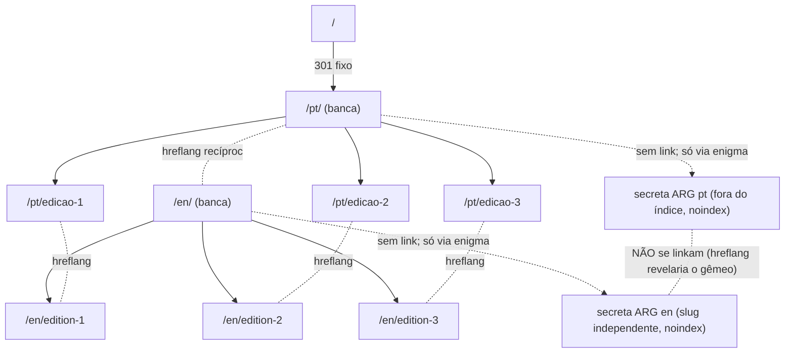
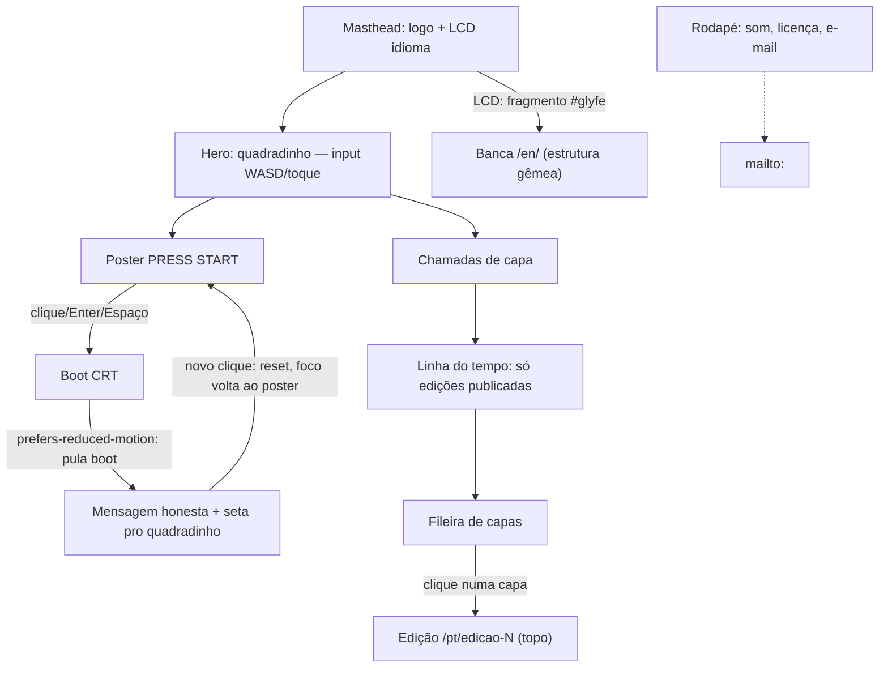
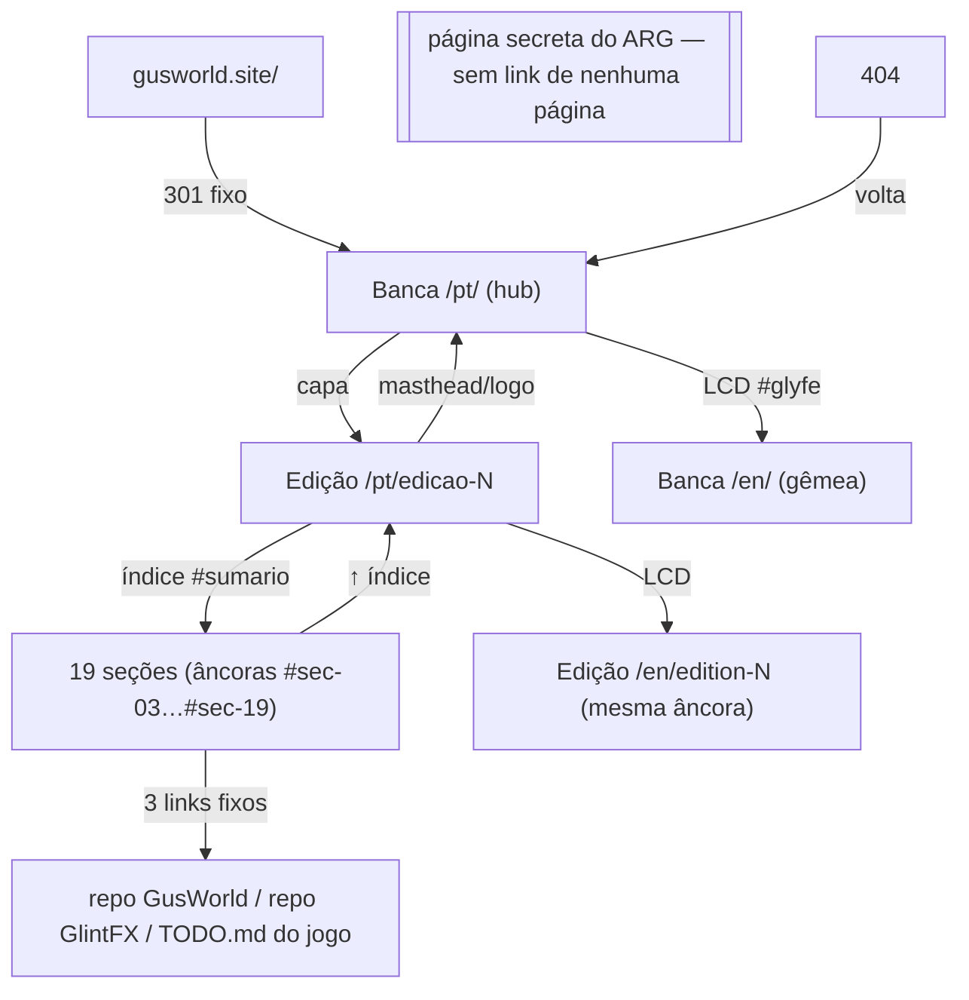

# IA-WIREFRAME — Arquitetura de informação e wireframe-esqueleto da Glyfesse

> Item do board: `IA-WIREFRAME` (W3). **Esqueleto, sem pele.** A identidade visual está fechada (tokens, tipografia, papel×tela, LCD, quadradinho — mocks `05`–`13` aprovados) e **não se reabre aqui**: este documento organiza onde cada peça mora e como se chega a ela. Nada abaixo é decisão nova de produto — é a consolidação estrutural do que o líder já decidiu, mais as consequências arquiteturais inevitáveis; o que sobrou em aberto está na §7.
>
> Fontes: memórias `anatomia_da_edicao`, `a_cadencia_editorial`, `primeira_dobra`, `project_i18n_switch`, `gus_le_o_bus`, `bugs_e_previsoes`, `publico_do_site`, `o_site_e_um_brinquedo`, `project_site_escopo`; `docs/inventario-publicavel.md`; mocks `07`, `08`, `09`, `10`, `11a`, `12`, `13`; `TODO.md`.
>
> Convenção: `[canon]` = decidido, herdado sem alteração · `[recomendação]` = ponto reversível decidido aqui com justificativa · `[slot: ux-writer + líder]` = todo texto (nunca escrito neste doc) · `[ABERTO]` = vai pra §7, decisão do líder.
>
> ⚠️ O estado atual em produção é a página "em breve" (placeholder `noindex`). Este documento descreve o site do **lançamento** (1.0), não o que está no ar hoje.

---

## 0. O princípio que dá a IA de graça: SUMÁRIO DE REVISTA

A revista BR dos anos 90 já resolvia leigo × expert **com sumário, não com arquitetura**: o leigo folheia a frente, o expert cava até o fim, o índice guia os dois. Consequência estrutural dura: **não existem áreas separadas "para leigos" e "para experts"**. Existe UMA unidade de conteúdo — a edição — com o expert no fim da rolagem (seções 16–18) e o índice-âncora como roteador. Qualquer proposta de "página de devlog", "área técnica" ou "página sobre" separada REPROVA: a edição carrega tudo, na ordem clássica BR; a banca lista tudo que existe. Sem menu global, sem breadcrumbs, sem dashboard.

---

## 1. Sitemap e rotas

Domínio: `gusworld.site` (`DOMINIO-DNS` ✅). Fonte única de conteúdo dinâmico: array `$edicoes` (ver `CRONOLOGIA-DADOS`).

### 1.1 Árvore de rotas

```
gusworld.site
├── /                                    → 301 fixo → /pt/  (config servidor; NUNCA por IP/Accept-Language)
├── /pt/                                 → BANCA (home pt)
├── /en/                                 → BANCA (home en)
├── /pt/edicao-1                         → EDIÇÃO #1 · A Gênese         ⇄ /en/edition-1
├── /pt/edicao-2                         → EDIÇÃO #2 · Arquitetura      ⇄ /en/edition-2
├── /pt/edicao-3                         → EDIÇÃO #3 · O quadrado azul  ⇄ /en/edition-3
├── /pt/<slug-secreto-pt>                → página secreta do ARG pt (fora do índice, noindex) — §7.1
├── /en/<slug-secreto-en>                → página secreta do ARG en (slug INDEPENDENTE; não linkada à pt) — §7.1
├── /pt/404 · /en/404                    → 404 por idioma (ErrorDocument por diretório)
├── /pt/rss.xml · /en/rss.xml            → feeds (gerados de $edicoes) — ver §7
├── /sitemap.xml                         → gerado de $edicoes (exclui a secreta)
├── /robots.txt                          → aponta o sitemap.xml; NÃO menciona a secreta
├── /api/cupom-voto.php  (POST only)     → único backend vivo; não indexável, não cacheável
├── /favicon.ico, /apple-touch-icon*.png → ícones (5 resoluções já prontas no jogo)
```



### 1.2 Tabela por rota

| Rota (pt) | Rota (en) | Tipo | `sitemap.xml`? | `noindex`? | `hreflang` | O que gera |
|---|---|---|---|---|---|---|
| `/pt/` | `/en/` | banca (home) | Sim | Não | pt-br ⇄ en, x-default=pt | PHP data-driven (`foreach $edicoes`) |
| `/pt/edicao-N` | `/en/edition-N` | edição | Sim | Não | pt-br ⇄ en, x-default=pt | PHP estático + include header/footer (a #3 instancia o quadradinho) |
| `/pt/<slug secreto pt>` | `/en/<slug secreto en>` (independente, §7.1) | secreta-ARG | **Não** | **Sim** (`noindex,nofollow`) | **nenhum** (nunca cruzado — revelaria o gêmeo) | PHP estático, sem link de entrada; uma por idioma |
| `/pt/404` | `/en/404` | 404 | Não | Sim (`noindex,follow`) | nenhum | `ErrorDocument 404` por diretório (`.htaccess`) |
| `/` | — | redirect 301 fixo | Não | — | — | config de servidor |
| `/pt/rss.xml` | `/en/rss.xml` | feed | Não (referenciado via `<link rel="alternate" type="application/rss+xml">` no `<head>`) | — | — | PHP gerado de `$edicoes`, filtrado por idioma |
| `/sitemap.xml` | — (um só, anotações hreflang por par) | config | — | — | — | PHP/script gerado de `$edicoes` |
| `/robots.txt` | — | config | — | — | — | arquivo estático |
| `/api/cupom-voto.php` | — | endpoint (POST) | Não | POST, não indexável por natureza | — | PHP + persistência (o único backend vivo) |
| favicon + ícones | — | asset | Não | — | — | arquivos estáticos |

**Não existem páginas-de-seção autônomas.** Editorial, Galeria de Bugs, Entrevista, Cemitério, HQ etc. (as ~19 seções da anatomia) são **âncoras `#sec-NN` dentro da própria edição** (confirmado no mock `09-anatomia-edicao.html`: `#sumario`, `#sec-03`…`#sec-19`), não rotas. Idem os brinquedos: componentes instanciados dentro da edição/banca, sem rota própria (`D-BRINQUEDOS` [canon]).

### 1.3 ★ A CONTAGEM — o número que o `D-STACK` espera

```
banca (pt+en)                 2
edições (3 × pt+en)           6
secreta do ARG (2, bilíngue)  2   ← líder escolheu paridade (§7.1); 2 slugs independentes
404 (pt+en)                   2
──────────────────────────────
TOTAL NO LANÇAMENTO          12 páginas HTML
```

✅ Resolvido (§7.1): a secreta é **bilíngue** (uma por idioma, slugs independentes, não interligadas) → total **12**. Baseline do `D-STACK`: **12**.

**Endpoints não-página:** 1 backend vivo (`/api/cupom-voto.php`), 2 feeds RSS, 1 `sitemap.xml`, 1 `robots.txt`, 1 conjunto de ícones, 1 regra de redirect (`/`→`/pt/`).

**★ Fórmula de crescimento** (a IA é estável sob o drip):

> **+1 edição publicada (`$edicoes`: `rascunho`→`publicada`) = +2 URLs (pt+en)** — banca, linha do tempo, `sitemap.xml` e os 2 RSS crescem **sozinhos** pelo mesmo `foreach $edicoes`. Nenhuma navegação global é re-editada quando o número cresce. O único trabalho manual ao publicar a edição N é o conteúdo dela (`edicao/N` + `edition/N`) + a entrada no array — isso é conteúdo, não arquitetura. `[recomendação]` sitemap e RSS gerados do array (script PHP), nunca mantidos à mão — é o que fecha o círculo.

---

## 2. Tipos de página (o site inteiro tem 4) e estático × dinâmico

1. **A BANCA = a home** (`/pt/`, `/en/`). O arquivo VIRA a home: edições enfileiradas via `foreach $edicoes`, bordas amarelando pela idade real. Hero = **quadradinho jogável da #3** (brinquedo primeiro) + **PRESS START** (boot CRT → mensagem honesta) + **linha do tempo** (scrubber que mostra SÓ edições visuais já publicadas — nunca estágio não-publicado, senão spoila o drip; nasce com 1 ponto).
2. **A EDIÇÃO** (`/pt/edicao-N` ⇄ `/en/edition-N`). Rolagem única + índice-âncora; as ~19 seções fixas (revista cheia; vazio-com-graça), expert no fim; índice fecha com os 3 links fixos. Brinquedos **por edição** como componentes reusáveis instanciados.
3. **A página secreta do ARG** — fora do índice, fora do sitemap, não indexável. Nada além disso é dito aqui (higiene de spoiler).
4. **O 404** — in-world, microcopy com pitada de Sylvarin `[slot: ux-writer + líder]`.

Não há mais nada: sem "sobre", sem "contato" (contato = e-mail no rodapé, `MODERACAO`), sem devlog separado (o devlog É a edição; a listagem É a banca).

### 2.1 Mapa estático × dinâmico por camada (insumo do `D-STACK`)

- **Servidor (PHP mínimo):** include de header/footer; `foreach $edicoes` (banca, linha do tempo, sitemap, RSS); i18n (href do par gêmeo sai do PHP, nunca de mapeador JS); **poll do cupom** (o ÚNICO backend real; resultado na edição seguinte).
- **Cliente (JS mínimo, por edição):** quadradinho (input+loop, lógica pura já sob TDD `node --test`); álbum (`localStorage`); 2 botões de som; os 2 vazios-de-tela animados (terminal verde da Galeria de Bugs; CRT do "Gus lê o bus").
- **CSS puro (zero JS):** envelhecimento por idade, dobra, CRT desligável via `:has()`, sprites `steps()`, animação da LCD (o JS só marca o `<html>`; quem anima é o CSS — bug de JS nunca deixa a revista invisível).
- **Config de servidor:** redirect da raiz, `ErrorDocument` 404 por diretório, headers de cache.

### 2.2 Cache (CDN Hostinger) por rota

| Rota/peça | Camada | Cache recomendado |
|---|---|---|
| `/pt/edicao-N`, `/en/edition-N` | PHP estático (fixo após publicar) | TTL longo (1 dia+) + purge manual só se houver correção |
| `/pt/`, `/en/` (banca + linha do tempo) | data-driven de `$edicoes` | **purge no evento de publicar** (preferível a TTL curto permanente — publicação é rara, drip) |
| `/sitemap.xml`, `/pt/rss.xml`, `/en/rss.xml` | data-driven de `$edicoes` | mesmo gatilho de purge da banca |
| `/robots.txt`, favicon/ícones | estático | TTL longo/muito longo |
| `/` (redirect 301) | config | TTL curto no redirect em si (reversível) |
| `/pt/404`, `/en/404` | config | default de 4xx (não cachear) |
| secreta do ARG | PHP estático | indiferente — a proteção é roteamento/indexação, não cache |
| `/api/cupom-voto.php` | **backend vivo** | **`Cache-Control: no-store`**; CDN faz **bypass total de `/api/*`** — o único caminho que nunca passa pela borda |
| `.js`/`.css` dos interativos | asset | TTL longo (versionável) |

**Regra de fundo:** tudo que nasce de `$edicoes` compartilha o **mesmo gatilho de invalidação** (o evento "líder publica edição") — nunca dessincroniza entre si.

### 2.3 i18n estrutural (`I18N-CONTRATO-URL`, fechado `[canon]`)

- **Ambos prefixados** (`/pt/…` ⇄ `/en/…`); nenhum idioma é de primeira classe; one-way-door: nunca mover URL de novo.
- **Raiz `/` → 301 fixo pro `/pt/`** — NUNCA por IP nem idioma do navegador; a raiz não é tela seletora.
- **Seletor visível = LCD do masthead** (o "expediente aceso", mock 13): **NAVEGA** pra URL gêmea (nunca troca texto no cliente; funciona sem JS; gatilho visual via fragmento `#glyfe`, não querystring).
- **`hreflang` recíproco + `x-default`** em toda página pública dos dois lados:

```html
<!-- banca /pt/ (edições seguem o mesmo padrão com o par edicao-N ⇄ edition-N) -->
<link rel="canonical" href="https://gusworld.site/pt/">
<link rel="alternate" hreflang="pt-br" href="https://gusworld.site/pt/">
<link rel="alternate" hreflang="en" href="https://gusworld.site/en/">
<link rel="alternate" hreflang="x-default" href="https://gusworld.site/pt/">
```

- **`x-default` = sempre o par `/pt/`** `[recomendação]`: espelha a regra já fixada do redirect da raiz — o humano sem preferência e o buscador sem preferência caem no mesmo lugar. Não fere "nenhum idioma é de primeira classe" (essa regra é sobre estrutura de URL, não sobre destino-padrão).
- **404:** sem `hreflang`/`canonical`; `noindex, follow`; `lang` conforme o diretório que serviu.
- **Secreta (bilíngue, §7.1):** as duas — pt e en — sem `hreflang`, sem `canonical` cruzado (só canonical-self defensivo), `noindex, nofollow`. NUNCA se apontam uma pra outra (nem por `hreflang`, nem pela LCD): a interligação revelaria o gêmeo. A LCD do masthead não se aplica (a secreta não tem masthead — §3.3).
- **Assimetria tolerada:** edição publicada só em pt sai com aviso honesto e **sem** o par `hreflang="en"` (nunca alternate apontando pra URL inexistente); o par recíproco entra nas duas páginas no mesmo commit quando a tradução chega. Nunca existe página órfã de `hreflang`.
- **Ids de âncora idênticos em pt e en** (`#sec-04` é `#sec-04` nas duas línguas): link profundo tem gêmeo exato, e a LCD troca só o prefixo de URL mantendo o fragmento.

---

## 3. Wireframe-esqueleto por tipo de página

### 3.1 Tipo 1 — A BANCA (home)

```
<header role="banner" id="masthead">                    [canon: mocks 10/13]
  1. Logo/wordmark GLYFESSE
  2. LCD de idioma — id="lcd-idioma"                    [canon: mock 13]
     (link real → URL gêmea; repouso: "BUILD pt-br" / "glyfe --en ▶";
      a LCD NUNCA veste o prefixo de voz do Gus — é mostrador de máquina)

<main role="main">
  <section id="hero" aria-label="Quadradinho jogável">  [canon: mocks 05/06/10]
  3. O quadradinho (instância do componente da Edição #3)
     - PARADO até input, em todo lugar (canon vigente pós-revert de 2026-07-16)
     - desktop: "clique na tela e use WASD" · mobile: "toque para mover" + d-pad
     - prefers-reduced-motion: Gus parado no destino + legenda escrita

  <section id="press-start" aria-label="Poster aceso — PRESS START">
  4. Poster (reuso do asset do pôster central)          [recomendação: bloco
     - role="button" focável; Enter/Espaço = clique      PRÓPRIO logo abaixo do
     - repouso → boot CRT → mensagem honesta → volta     hero, não dentro dele —
                                                          2 alvos claros; ver §7.2]
  <section id="chamadas" aria-label="Chamadas de capa">  [canon]
  5. Manchete + dek da edição em destaque
     (mobile: vira tira que acompanha a rolagem)

  <section id="linha-tempo" aria-label="Linha do tempo"> [canon: mock 07]
  6. Scrubber — SÓ edições visuais publicadas
     - nasce com 1 ponto (o quadrado da #3)
     - role="slider" no puxador; setas movem; meses/pontos clicáveis (a11y)

  <section id="banca" aria-label="A banca de edições">   [canon; landmark: §7.3]
  7. Fileira de capas — foreach $edicoes
     - cada capa = <a> pra edição; borda amarela pela idade real
     - edição não-publicada: AUSENTE (nunca "em breve" — spoila o drip)

<footer role="contentinfo" id="rodape">                  [canon]
  8. 2 botões de som (efeitos ON / música OFF por padrão)
  9. Licença · 10. E-mail de contato
     (SEM lista de navegação — não há outras páginas pra listar)
```

**Fluxo de navegação:**



**Mobile 390px:** coluna única; masthead afina (LCD sempre visível — nunca esconder o expediente aceso); hero quase quadrado (área de dedo; d-pad ≥ 44×44pt por botão); PRESS START abaixo do hero, nunca sobreposto (evita toque trocado entre andar e START); chamadas viram tira; scrubber com puxador maior + meses clicáveis como alternativa ao arraste; banca em 1 coluna; botões de som ≥ 44×44pt.

**a11y:** skip-link "pular pro quadradinho"; `<h1>` único; ordem de Tab: LCD → hero → PRESS START → puxador → meses → capas → som → licença/e-mail; `aria-live="polite"` na mensagem do PRESS START; o quadradinho **nunca é o único caminho pra informação** (legenda escrita sob `prefers-reduced-motion`); scanline/CRT desligável sem JS.

### 3.2 Tipo 2 — A EDIÇÃO

Modelo `[canon]`: **rolagem única + índice que ancora**. Toda seção existe em toda edição (revista cheia); cada uma tem 2 estados — **cheia** ou **vazio-com-graça** — na MESMA âncora, sem clique extra. Copy de cada vazio: **sempre co-decidida com o líder**.

| # | id | Seção | Grupo | Estado possível |
|---|----|----|----|----|
| 01 | `#capa` | Capa (com chamadas) | ABERTURA | sempre cheia (data-driven de `$edicoes`) |
| 02 | `#sumario` | Índice | ABERTURA | sempre cheia (data-driven + 3 links fixos) |
| 03 | `#sec-03` | Editorial · Carta do Gus | ABERTURA | cheia ou vazio-com-graça |
| 04 | `#sec-04` | Reportagem de capa | CORPO | cheia (o marco do número) · **slot de interativo por edição** |
| 05 | `#sec-05` | A Nota do jogo inacabado | FIXA | evergreen (sobe a cada edição) |
| 06 | `#sec-06` | Galeria de Bugs | FIXA | cheia (minerada de journal+commits) OU vazio — **vazio é TELA** (terminal verde animado) |
| 07 | `#sec-07` | Cemitério das Ideias Mortas | FIXA | cheia ou vazio-com-graça |
| 08 | `#sec-08` | Detonado | FIXA | evergreen — sempre "AGUARDE" |
| 09 | `#sec-09` | Errata + Cartas | FIXA | cheia ou vazio-com-graça |
| 10 | `#sec-10` | Classificados in-world | FIXA | evergreen |
| 11 | `#sec-11` | HQ | FIXA | evergreen (pool rotativo de 3 variantes) |
| 12 | `#sec-12` | Próximos Lançamentos | FIXA | cheia (do `TODO.md` do jogo, sem data) ou vazio |
| 13 | `#sec-13` | Pôster central | ENCARTE | data-driven por edição |
| 14 | `#sec-14` | Brinde | ENCARTE | evergreen |
| 15 | `#sec-15` | Cupom recortável | ENCARTE | **É o slot do interativo** quando houver cupom ativo |
| 16 | `#sec-16` | A Entrevista | EXPERT | cheia ou versão curta |
| 17 | `#sec-17` | Seção de Programação | EXPERT | cheia ou versão curta |
| 18 | `#sec-18` | O Gus lê o bus | EXPERT | cheia (trecho real do bus + reação) OU vazio — **vazio é TELA** (CRT, bus vazio) |
| 19 | `#sec-19` | Expediente | FECHAMENTO | sempre cheia (créditos, licença) |

- **Os 2 vazios-TELA** (06 e 18): a caixa da seção é papel; só o retângulo do terminal/CRT dentro dela é tela (regra papel×tela), scanline desligável via `prefers-reduced-motion`.
- **Slot de interativo por edição** `[canon: D-BRINQUEDOS]`: nenhum brinquedo mora no chrome. A #3 carrega o quadradinho em `#sec-04`; o cupom É a `#sec-15` quando ativo; futuros (bancada, Glyfa, álbum) entram na `#sec-04` do número em que estrearem.

**O índice (`#sumario`) como roteador:** uma entrada por seção com material relevante naquele número (o mock 09 mostra que pode omitir seção puramente evergreen; toda seção com marco entra). Fecha com os **3 links fixos** `[canon]`: repo GusWorld, repo GlintFX, `TODO.md` vivo do jogo (legenda do Gus: "DUVIDO VOCÊ LER! 🤣"). `[recomendação]` os 3 abrem com `rel="external noopener"`. ⚠️ Amarra `RAGE-ISSUES`: o vetor de issues é permanente e por-edição; a issue policy precisa estar de pé antes do lançamento.

**Voltar-ao-índice** `[canon, herdado do mock 09]`: ao fim de CADA seção, link discreto `↑ índice` (`href="#sumario"`); ao fim da folha, `↑ voltar ao índice` ligeiramente mais explícito. Nunca vira barra fixa/chrome de app.

**Mobile 390px:** coluna única (a rolagem já é mobile-native); o índice permanece **lista completa** (não colapsa em accordion, não vira sticky nav — seria o "portal" que o formato recusa); pixel art sempre em bloco de largura cheia; interativos ≥ 44×44pt; vazios-TELA em largura cheia da coluna; `↑ índice` tocável isoladamente.

**a11y:** skip-link "pular pro índice"; `<h1>` = manchete da capa, cada seção `<h2>`, subtítulos `<h3>` (nunca pula nível); vazios-TELA com `role="img"` + `aria-label` descritivo; interativos nunca são o único caminho pra informação (equivalente estático/textual ao lado); `prefers-reduced-motion` cobre dissolução da capa, scanlines e transições; LCD presente no masthead da edição (mesmo id e comportamento da banca).

### 3.3 Tipo 3 — Página secreta do ARG

Conteúdo, mecânica e gatilho **fora de escopo aqui e sempre** (spoiler-safe). Esqueleto mínimo: sem link em menu/índice/rodapé/sitemap; não referenciada por nenhuma outra página; `noindex, nofollow`; **não entra no robots.txt** (listar lá a revelaria). **Bilíngue (§7.1):** duas páginas independentes (pt/en), slugs distintos, que NÃO se linkam. **Chrome → SEM chrome de revista (§7.2):** reusa só os tokens (cor/fonte), sem masthead nem rodapé — efeito "isto vazou de fora do site". Slug: não-adivinhável, escolha do `ux-writer` + líder (§7.4) — agora são dois.

### 3.4 Tipo 4 — O 404

```
<header role="banner" id="masthead">     [mesmo masthead — LCD inclusa]
<main role="main">
  <section id="erro-404">
    <h1>[slot: ux-writer + líder — microcopy in-world, pitada de Sylvarin]</h1>
    <p>[slot: ux-writer + líder]</p>
    <a href="/pt/ ou /en/">[volta pra banca do MESMO idioma da URL que falhou]</a>
<footer role="contentinfo">              [mesmo rodapé padrão]
```

Nunca força troca de idioma; qualquer efeito (papel rasgado/CRT) segue a regra de `prefers-reduced-motion`.

### 3.5 Modelo de navegação global



**Não existe menu de navegação global além disso.** A banca é o hub; o índice é o roteador interno da edição.

### 3.6 Checklist a11y estrutural (todo tipo de página)

- [ ] Skip-link por tipo (banca → hero; edição → índice; 404 → mensagem)
- [ ] Landmarks únicos: `header[banner]` → `main` → `footer[contentinfo]`
- [ ] Hierarquia de heading previsível, nunca pula nível
- [ ] Ids de âncora estáveis e **idênticos em pt e en**
- [ ] `prefers-reduced-motion` em todo bloco animado; scanline/CRT desligável **sem JS** (`:has()`)
- [ ] Brinquedo nunca é o único caminho pra informação
- [ ] Touch target ≥ 44×44pt em todo alvo tocável
- [ ] `aria-live="polite"` nas revelações sem navegação
- [ ] Sem informação só por cor (borda amarela por idade sempre acompanha data escrita)
- [ ] Foco visível + ordem de Tab lógica
- [ ] Secreta do ARG: `noindex, nofollow`, fora de toda árvore

**Tokens:** este documento não introduz token novo — tudo referencia `docs/design/tokens.css` já calibrado. **Responsivo:** mobile <768px coluna única sem exceção; tablet segue a coluna da edição (banca pode ganhar 2 colunas se couber — breakpoint exato é do `DESIGN-IDENTIDADE`); desktop mantém `max-width` legível de coluna (~70ch, mock 09).

---

## 4. ★ Insumos pro `D-STACK` (o que a IA exige que a stack suporte)

O `D-STACK` é **decisão exclusiva do líder**; isto é o insumo que faltava, não a decisão.

1. **Volume: 12 páginas HTML no lançamento** (§7.1 fechado: secreta bilíngue) + fórmula de crescimento **+2 URLs por edição publicada** — a stack precisa tornar isso barato (include + `foreach`), nunca re-edição de navegação.
2. **i18n de URL:** dois prefixos simétricos `/pt/`⇄`/en/` como pastas físicas; redirect 301 fixo da raiz; `hreflang` recíproco + `x-default` emitido pelo servidor; href do par gêmeo gerado no PHP (sem mapeador JS).
3. **Fonte única `$edicoes`** (array/JSON: data, frame, legenda, estado) percorrida por banca, linha do tempo, `sitemap.xml` e 2 feeds RSS — publicar = trocar `rascunho`→`publicada`, zero HTML tocado.
4. **RSS por idioma** (2 feeds gerados do mesmo array — §7.5) + `sitemap.xml` gerado + `robots.txt`.
5. **1 endpoint backend vivo:** poll do cupom (POST, persistência, `no-store`, fora da CDN). Todo o resto é cacheável; a CDN precisa suportar bypass de `/api/*` e purge-on-publish do que nasce de `$edicoes`.
6. **Pixel art na web:** `image-rendering: pixelated` + escala inteira + sprites via CSS `steps()` — exigência de CSS, não de servidor.
7. **Peças interativas client-side já testadas:** quadradinho, cupom, álbum (`localStorage`), som — lógica pura sob TDD zero-dep (`node --test` em dev/CI; o no-Node do Hostinger é runtime, não impede teste).
8. **Zero terceiro por padrão** (`D-ANALYTICS`/`ZERO-DADO`): sem analytics de terceiro, sem CDN de fonte externa — fontes e assets servidos do próprio domínio. Único cookie do site: o do voto do cupom (`glyfesse_votou`), funcional e de primeira parte, não identifica o visitante.
9. **Config de servidor:** `.htaccess` (redirect da raiz, `ErrorDocument` por diretório, headers de cache), compatível com o Hostinger Premium **sem Node**.
10. **Funciona sem JS:** navegação, leitura, troca de idioma e CRT-off nunca dependem de JS.

---

## 5. Higiene aplicada (vale pro doc e pra implementação)

Spoiler-safe: nenhuma menção a conteúdo da never-reveal list nem a sistema/easter-egg; a página do ARG aparece SÓ como "página secreta do ARG (fora do índice, não indexável)" e **não entra no robots.txt**. Nome de menor: só "Gus Dragon". Zero segredo/token. `Projects/gusworld/` só lido, nunca tocado. Nenhuma métrica é critério de sucesso; a régua é *"se for maçante eu não quero"* — este entregável é esqueleto: correto e enxuto aqui é virtude, a graça mora na pele que já existe.

---

## 6. Contradições reconciliadas (registro)

1. **Mobile do quadradinho:** a linha `MOBILE-RISCO` do `TODO.md` ainda diz "auto-anda, toque para assumir", mas a memória `primeira_dobra` registra o **revert do líder no mesmo dia** (2026-07-16): canon vigente = **PARADO até input, em todo lugar** (desktop: clique+WASD; mobile: toque+d-pad). Este doc usa o canon revertido. → Corrigir a linha do `TODO.md` (tarefa do orquestrador, fora deste doc).
2. **Quantas edições nascem:** o mock 07 chegou a marcar #1–#4; a decisão canônica (`A-CADENCIA`, revista 2026-07-16) é **nasce com 3** (#1, #2, #3) e o scrubber nasce com **1 ponto visual** (o quadrado da #3). Este doc usa 3.
3. **Voltar-ao-índice:** não estava em aberto — o mock 09 aprovado já resolve (`↑ índice` por seção). Documentado como canon herdado, não decisão nova.
4. **Descrição do fluxo mobile nos dois insumos:** unificada no canon pós-revert (item 1).

---

## 7. Questões abertas — RESOLVIDAS (líder, 2026-07-17, via AskUserQuestion)

1. **Secreta do ARG: idioma → ★ NAS 2 LÍNGUAS (paridade).** O líder honrou a régua "TEM de ser as 2 línguas". Consequências arquiteturais duras:
   - **Total sobe para 12 páginas** (§1.3 atualizado).
   - **Dois slugs independentes e não-adivinháveis**, um por prefixo (`/pt/<slug-a>`, `/en/<slug-b>`) — NUNCA o mesmo texto de slug sob os dois prefixos.
   - ⚠️ **Os dois NÃO se linkam por `hreflang` nem pela LCD** — um alternate/canonical cruzado revelaria o gêmeo. São duas páginas secretas *independentes*, cada uma `noindex, nofollow`, fora de todo sitemap/robots/índice, canonical-self defensivo. A paridade é de existência (as duas línguas têm sua secreta), não de interligação.
2. **Chrome da secreta → ★ SEM CHROME DE REVISTA.** Reusa só os tokens (cor/fonte), sem masthead nem rodapé — efeito "isto vazou de fora do site"; a página é um achado, não parte da banca. (§3.3 atualizado.)
   **Posição do PRESS START → ★ BLOCO PRÓPRIO ABAIXO DO HERO.** 2 alvos claros (quadradinho e START separados), evita toque trocado no mobile. (§3.1 já modela como bloco próprio; os mocks 08 e 10 se integram nesse bloco.)
3. **Landmark da fileira de capas → `<section>`** `[recomendação, fecha com o dev]` — é o corpo editorial da banca, não um menu. Não bloqueante; confirmável na implementação.
4. **String do slug secreto → slot do `ux-writer` + líder** na hora de construir a secreta: gerado/não-adivinhável, nunca palavra temática deduzível do enigma. Agora são DOIS (um por idioma).
5. **RSS → ★ 2 FEEDS POR IDIOMA** (`/pt/rss.xml`, `/en/rss.xml`), mantendo "cada URL é monolíngue". Mesmo `$edicoes`, filtrado por idioma.
6. **Manifest PWA → deixado de fora do 1.0** `[recomendação]`: não é requisito de nenhum item do board; os ícones (5 resoluções) já existem, então é adição barata e reversível numa edição futura se surgir necessidade real. Não incluído agora (anti-OE).
